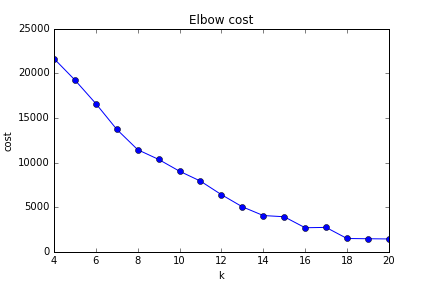

# Spark_Scala

When one want to cluster a dataset with a KMeans algorithm, one has to give as input to the method the number of cluster. Indeed, the KMeans is an unsupervised machine learning method.
But it is not always possible to know this number apriori to the clusterization of the dataset.
In this repository, we propose to investigate various method to determine the optimal number of clusters (k) in a dataset.
For doing that, we are going to use Spark and Scala. All the sources used for this analisys are available in the repository.

## Dataset

A "toy" dataset is used here. As we can see, it is obvious that 16 clusters constitued this 2D dataset.

  

## The Elbow Method - an intuitive approach

### Using the global dataset

One approach is named the Elbow method. This method suggest to compute the sum of squared errors (SSE) for various value of k. Then we plot the SSE for each value of k.
When the line chart looks like an arm, then the "elbow" on the arm is the value of k that is the best.
The idea is that we want a small value of SSE and we know that the SSE tends to 0 as k tends to the number of points in the dataset. So we choose the value of k such as an increase of this value does not induce a significant decrease of the SSE.

Here, we use the computeCost function available in Spark to compute the SSE. 

It appears on this figure that a good value of k can be 15 or 16 that is consistent with our dataset.

### Train-Validation approach
Here we propose to plot the Elbow line based on a train-validation approach.
Thus the initial dataset is split randomly in a training and a validation dataset. The training dataset contains 75% of the initial dataset. Now the model of the KMeans algorithm is computed based on the training dataset. We plot the SSE computed on the training and validation datasets.

Based on the cost computed on the validation dataset, it is clear that 16 is the optimal number of clusters.
